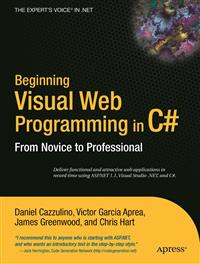

#Apress Source Code

This repository accompanies [*Beginning Visual Web Programming in C#*](http://www.apress.com/9781590593615) by Daniel Cazzulino, Victor Garcia Aprea, James Greenwood, and Chris Hart (Apress, 2004).

Download the files as a zip using the green button, or clone the repository to your machine using Git.

##Releases

Release v1.0 corresponds to the code in the published book, without corrections or updates.

##Contributions

See the file Contributing.md for more information on how you can contribute to this repository.
